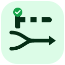
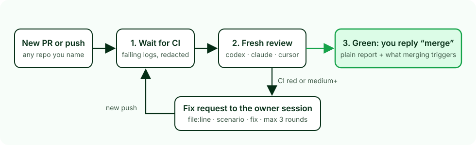

<div align="center">



# pr-gate

**Merge on a reply, not on a read.**
A skill that reviews each pull request, sends the fixes back to the session that wrote it, and asks you only one thing at the end: `merge`?

[](#quick-start)
[](#pick-a-reviewer)
[](#verify)
[](LICENSE)

</div>

---

## At a glance

| You do | pr-gate does | You get |
|---|---|---|
| `/pr-gate owner/repo 12` | Waits for CI. A reviewer that didn't write the code checks it against the repo's own docs. Fix requests go to the owner session, for up to 3 rounds | A short, plain report and one question: reply `merge` |

<p align="center">
  
</p>

---

## Why

The agent that wrote a change is the worst judge of it. A second model, with a fresh context, keeps finding real defects. Green CI is not enough either: local checks can pass while the deploy breaks.

Doing this by hand means reading diffs, pasting findings into the right chat, and checking back after every push. pr-gate runs that loop and stops only when it needs you:

| It stops for you when | You see |
|---|---|
| CI is green and only low findings remain | What the PR does, what was checked, what merging will trigger |
| 3 rounds pass and it still isn't clean | What was fixed, what's still open, your options |
| No session owns the branch | The fix request posted on the PR, and which session should pick it up |

---

## Quick start

The skill is a folder. Claude Code loads it from `~/.claude/skills/pr-gate`.

```bash
gh repo clone EranTzarum/pr-gate
cmd /c mklink /J "%USERPROFILE%\.claude\skills\pr-gate" "%CD%\pr-gate"
```

Then, in any Claude Code session:

```text
/pr-gate owner/repo 12 --reviewer codex
/pr-gate owner/repo --all-open
```

Needs `gh` (logged in) and Python 3. Each reviewer needs its own CLI: `codex`, `claude` or Cursor's `agent`.

### Fix requests from any host: the inbox mod

From the Claude desktop app, pr-gate messages the owner session directly. From anywhere else (Codex, Cursor, a plain terminal), or when no session matches, it drops the fix request in `~/.pr-gate/inbox/` and also comments on the PR. `mod/` is a Claude Code mod (a plugin of function hooks) for the sessions that write PRs:
- every minute it asks `gh` which PR the session's branch has;
- it starts a turn with any fix request for that PR once the session is idle;
- it shows the PR's pr-gate round in the status line.
`/pr-gate-inbox` checks right away.

```bash
claude --plugin-dir "$HOME/.claude/skills/pr-gate/mod"
```

Or add the folder to `CLAUDE_CODE_PLUGIN_DIRS` so every session loads it. Headless runs (`claude -p`) never pick anything up. The mod API is early access; the PR comment keeps working without it.

### Verify

```bash
py -3 -m unittest discover tests
claude plugin test mod
```

Expected: `Ran 71 tests ... OK` and `3 pass`. No network calls; `gh` is mocked.

---

## Example

A PR adds a checkout discount helper. CI is red. Three rounds later:

```text
round 1  CI fail   codex   [high]   cart.py:13  cart total skips the last item (matches the CI log)
         → fix request sent, owner pushes
round 2  CI pass   claude  [high]   cart.py:8   percent not bounded: 150% gives a refund
                           [medium] cart.py:14  negative qty cancels other items
         → fix request sent, owner pushes
round 3  CI pass   codex   2 × medium remain
         → escalate: "3 rounds, still 2 medium. Fixed so far: … Options: …"
```

When a round comes back clean, you get this instead:

```text
PR owner/repo#12 "Add discount helper" is ready. Reply `merge` to merge it.
What it does: adds bounded percentage discounts and cart totals.
Checked: CI pass; claude review over 3 files, 2 rounds; repo docs: CLAUDE.md, AGENTS.md.
Left (low, optional): cart.py:3, MAX_ITEMS defined but never enforced.
Merging will: merge into main; then deploy.yml: npx supabase db push --linked
```

The full numbers for this run (time, cost, what each engine caught) are in [docs/evals.md](docs/evals.md).

---

## How it decides

| Severity | Means | Effect |
|---|---|---|
| `blocker` | Data loss, a security hole, a broken deploy | Fix round |
| `high` | Wrong behaviour on a main path | Fix round |
| `medium` | Wrong behaviour on an edge path, or a risky deploy step | Fix round |
| `low` | Real but minor | Listed in the report; doesn't block |

Review priority is fixed:
1. Security: auth, row-level security, secrets, data exposure.
2. Documented invariants.
3. Races.
4. Deploy risk: migrations, workflows.
5. Plain bugs.

A finding is dropped before it reaches anyone if:
- its `file:line` doesn't exist in the PR head;
- it has no concrete failure scenario;
- it has no fix.

Each round, the reviewer sees the earlier rounds' findings and keeps each one's severity unless the risk changed. That stops engines from re-grading a `low` into another fix round.

### Pick a reviewer

| `--reviewer` | Default model | Note |
|---|---|---|
| `codex` | `gpt-6.1-sol`, low effort | Default when the host is Claude |
| `claude` | `sonnet` | Default when the host is Codex or Cursor |
| `both` | codex and claude, findings merged | Offered for high-risk PRs; a cross-engine duplicate (same file, within 3 lines) is kept once, at the higher severity |
| `cursor` | `composer-2.5` | Opt-in only, never the default. 45–110 s of startup, and it carries your Cursor account's plugins and MCP tools whatever the sandbox ([evals](docs/evals.md)) |
| `subagent` | An Agent-tool subagent in the same session | Fresh context, same model family |

You pick the engine per run, and you can override the model with `--model` and `--effort`. If the engine fails, pr-gate tells you and offers the next one. It never switches engines silently.

**High-risk PRs get a stronger pass.** When the changed files touch migrations, auth/RLS, CI workflows or payments, codex runs at medium effort and claude runs `opus`, unless you pass `--model` or `--effort`. The reviewer is told which files triggered it, and the report says so.

### Lean runs

Every reviewer runs through `scripts/lean_run.py`. It's read-only, takes an explicit model, and loads none of your global MCP servers, skills, plugins or hooks, unless you grant one for that run. Same idea as the worker sandboxes multi-agent orchestrators use:

| Engine | What's left out | One-line prompt, before → after |
|---|---|---|
| codex | Everything in `~/.codex` except the login | timeout (>180 s) → 20 s |
| claude | User settings, hooks, plugins, skills, MCPs (the repo's own rules still apply) | 23 s → 7 s |
| cursor | Nothing: the CLI fetches the account's plugins from the server whatever `HOME` is; uses file I/O | 45–110 s either way |

The launcher also works on its own, from any terminal:

```bash
echo "Summarise src/ in 5 bullets" | py -3 "$HOME/.claude/skills/pr-gate/scripts/lean_run.py" codex --model gpt-6-luna --effort low --cwd .
cat prompt.txt | py -3 "$HOME/.claude/skills/pr-gate/scripts/lean_run.py" claude --model sonnet --mcp my-db --cwd .
```

---

## Safety rules

- **Never merges without your literal `merge` reply**, for that PR, after the green report. Before merging it re-checks that the head SHA and CI are unchanged.
- **Never** pushes, changes repo settings, turns on auto-merge, or uses `--admin`.
- Every script's output is **redacted**: tokens, JWTs, keys and URL passwords are masked before anything is printed, stored or sent.
- **Reviewers are read-only**, and a test enforces it.
- **3 rounds per PR**, kept in `~/.pr-gate/state`.

---

## Running it unattended

Not enabled. [docs/automation.md](docs/automation.md) compares a scheduled local poll, a GitHub Action and a webhook, with cost and risk for each. It recommends a 30-minute local poll, and only after a few weeks of on-demand use.

---

## Repo map

| Path | What |
|---|---|
| `SKILL.md` | The loop the host session follows |
| `references/review-prompt.md` | The reviewer's instructions and JSON output format |
| `scripts/pr_context.py` | PR, diff, CI, logs, docs, merge triggers → one JSON file |
| `scripts/review.py` | Runs a read-only engine and gates its output |
| `scripts/lean_run.py` | Lean headless launcher for codex, claude and cursor (also usable on its own) |
| `scripts/findings.py` | Verifies findings, decides the verdict, keeps round state |
| `scripts/handoff.py` | Writes a fix request to `~/.pr-gate/inbox/` for the inbox mod |
| `mod/` | The inbox mod: delivers fix requests to the session whose branch has the PR |
| `scripts/wait.py` | Waits for CI or a new push, as a process rather than a polling model |
| `scripts/redact.py` | Secret masking |
| `CLAUDE.md`, `AGENTS.md` | Rules for working on this repo |

## License

[MIT](LICENSE)
